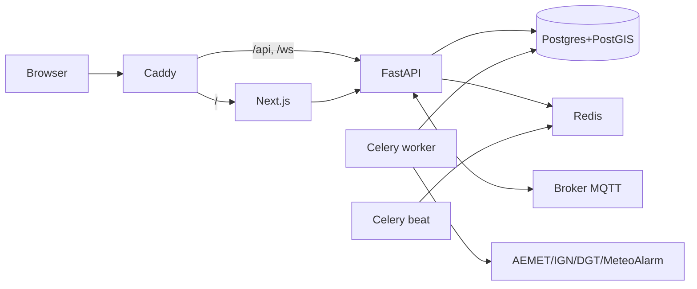

# ESPAlert

Agregador multi-riesgo de alertas oficiales en España: meteorología (AEMET y MeteoAlarm), sismicidad (IGN), tráfico (DGT) y un canal Meshtastic como respaldo cuando falla la red.

[](https://github.com/alfonsocastejon/ESPAlert/actions/workflows/ci.yml)
[](https://github.com/alfonsocastejon/ESPAlert/actions/workflows/deploy.yml)
[](LICENSE)


## Qué es

Una aplicación web que reúne en un único panel las alertas oficiales de cuatro fuentes públicas y las pinta sobre un mapa de España en tiempo real. Permite registro, favoritos, push del navegador y un canal Meshtastic vía MQTT para zonas con cobertura limitada.

## Características

- Mapa en tiempo real con MapLibre GL y tiles de OpenFreeMap.
- Listado con filtros por fuente, severidad, región y orden, con paginación.
- Predicción meteorológica diaria por municipio vía proxy a AEMET OpenData.
- Registro y login con JWT en cookie httpOnly.
- Notificaciones push web con VAPID.
- Conector Meshtastic vía MQTT (paho-mqtt).
- Panel de administración con roles `user` y `admin`.
- Tema claro y oscuro con persistencia.
- Accesibilidad WCAG AA: skip-link, foco visible, contraste verificado.
- Despliegue automático a un VPS por GitHub Actions.

## Stack

1. **Frontend**: Next.js 16 (App Router), React 18, TypeScript, SCSS con arquitectura ITCSS, MapLibre GL.
2. **Backend**: FastAPI, SQLAlchemy 2.0 async, Pydantic, asyncpg, GeoAlchemy2.
3. **Datos**: PostgreSQL 16 con PostGIS.
4. **Cola y cache**: Redis 7, Celery (worker + beat).
5. **Reverse proxy**: Caddy con HTTPS automático.
6. **Contenedores**: Docker y docker compose.
7. **Push**: pywebpush + claves VAPID.
8. **Mesh**: paho-mqtt contra Mosquitto propio + nodo Meshtastic físico actuando de gateway LoRa.

## Quickstart

```bash
git clone https://github.com/alfonsocastejon/ESPAlert.git
cd ESPAlert
cp .env.example .env          # editar AEMET_API_KEY, JWT_SECRET, VAPID_*
docker compose up -d
docker compose exec api alembic upgrade head
```

Frontend en [http://localhost:3000](http://localhost:3000), API en [http://localhost:8000](http://localhost:8000), Swagger en [/docs](http://localhost:8000/docs).

Detalle completo en [docs/03-instalacion.md](docs/03-instalacion.md).

## Arquitectura



## Documentación

La carpeta `docs/` contiene la memoria técnica completa:

1. [Introducción](docs/01-introduccion.md)
2. [Descripción](docs/02-descripcion.md)
3. [Instalación y preparación](docs/03-instalacion.md)
4. [Guía de estilos y prototipado](docs/04-guia-estilos.md)
5. [Diseño](docs/05-diseno.md)
6. [Desarrollo](docs/06-desarrollo.md)
7. [Pruebas](docs/07-pruebas.md)
8. [Despliegue](docs/08-despliegue.md) - y [evidencias](docs/08-despliegue-eval.md)
9. [Manual de usuario](docs/09-manual-usuario.md)
10. [Conclusiones](docs/10-conclusiones.md)

## Pruebas

```bash
cd apps/api && pytest --cov   # 65 tests, cobertura 66%
cd apps/web && pnpm test       # 59 tests
```

Detalle en [docs/07-pruebas.md](docs/07-pruebas.md).

## Despliegue

Pipeline en GitHub Actions: `ci.yml` para tests y typecheck, `deploy.yml` para build a `ghcr.io` y SSH al droplet de DigitalOcean. Pasos completos en [docs/08-despliegue.md](docs/08-despliegue.md).

## Licencia

MIT. Ver [LICENSE](LICENSE).
