# 4. Guía de estilos y prototipado

## Prototipo en Figma

El prototipo completo (wireframes, mockups, componentes y guía de tokens) está publicado en Figma:

[Prototipo de ESPAlert en Figma](https://www.figma.com/design/b3vdpd8GL9eVKItt2f2Hgc/ESPAlert?node-id=1-2&t=5OiOEQfBc9dN88xm-1)

El prototipo incluye:

- Pantallas mobile, tablet y escritorio.
- Componentes reutilizables con auto-layout.
- Variables de Figma para color, espaciado y tipografía.
- Estados de los componentes interactivos (hover, focus, disabled).
- Esquema claro y oscuro completo.

## Tokens de diseño

Los tokens están definidos en `apps/web/src/styles/settings/_variables.scss` y siguen el espacio de color HSL para facilitar variaciones de luminosidad y saturación.

### Paleta modo claro

- Fondo principal: `hsl(138, 73%, 97%)` (verde casi blanco)
- Fondo suave: `hsl(144, 78%, 93%)`
- Texto: `hsl(187, 31%, 11%)` (azul muy oscuro)
- Gris secundario: `hsl(0, 0%, 41%)`
- Naranja de marca: `hsl(28, 92%, 25%)`
- Botón registro / acento verde: `hsl(149, 100%, 86%)`

### Paleta modo oscuro

- Fondo principal: `hsl(187, 31%, 11%)`
- Fondo suave: `hsl(188, 33%, 5%)`
- Texto: `hsl(138, 73%, 97%)`
- Naranja de marca: `hsl(28, 96%, 57%)` (más vibrante por contraste)
- Botón registro: `hsl(188, 33%, 5%)`

El cambio de tema se hace mediante el atributo `data-theme="light|dark"` en `<html>` y se persiste en `localStorage` con la clave `espalert_theme`. Un script en `layout.tsx` evita el flash de tema incorrecto al cargar.

### Severidades

Los colores de severidad son consistentes entre claro y oscuro, con variantes claras (badges) y oscuras (puntos sobre el mapa):

- Rojo extremo: `hsl(0, 100%, 75%)` claro / `hsl(349, 100%, 35%)` oscuro
- Naranja severo: `hsl(37, 100%, 70%)` claro / `hsl(36, 100%, 35%)` oscuro
- Amarillo moderado: `hsl(65, 100%, 80%)` claro / `hsl(60, 100%, 27%)` oscuro
- Verde menor: `hsl(149, 100%, 86%)` claro / `hsl(151, 46%, 33%)` oscuro
- Morado mesh: `hsl(266, 100%, 68%)` claro / `hsl(264, 72%, 39%)` oscuro

## Tipografía

Familia: pila del sistema con fallback (`'Segoe UI', system-ui, -apple-system, sans-serif`). Esta decisión evita la descarga de fuentes externas y mejora First Paint.

Escala tipográfica:

- `$texto-xs`: 12 px (etiquetas)
- `$texto-sm`: 14 px (meta de alertas, ayuda de formularios)
- `$texto-base`: 16 px (cuerpo)
- `$texto-lg`: 18 px (subtítulos)
- `$texto-xl`: 24 px (títulos de sección)
- `$texto-2xl`: 32 px (títulos de página)
- `$texto-3xl`: 48 px (hero)
- `$texto-6xl`: 96 px (decorativo)

## Espaciado

Escala progresiva con base 4 px:

- `$espacio-2xs`: 2 px
- `$espacio-xs`: 4 px
- `$espacio-sm`: 8 px
- `$espacio-md`: 16 px
- `$espacio-lg`: 24 px
- `$espacio-xl`: 32 px
- `$espacio-2xl`: 48 px
- `$espacio-5xl`: 80 px

## Breakpoints

- Móvil: hasta 30 rem (480 px)
- Tablet: hasta 48 rem (768 px)
- Escritorio: desde 64 rem (1024 px)

El diseño es mobile-first: las reglas base aplican a móvil y los `@media` añaden estilos para pantallas mayores.

## Bordes y radios

- `$borde-radio`: 4 px (botones, inputs, tarjetas)
- `$borde-radio-lg`: 8 px (modales, contenedores grandes)
- `$borde-radio-pill`: 1000 px (badges redondeadas)

## Arquitectura SCSS (ITCSS)

Estructura de capas, de genérica a específica, en `apps/web/src/styles/`:

- `settings/_variables.scss`: tokens.
- `tools/_mixins.scss`: mixins reutilizables (`desde`, `hasta`, `oculto-visualmente`, `truncar`, `flex-centro`).
- `generic/_reset.scss`: reset CSS.
- `elements/_base.scss`: estilos de etiquetas HTML, `:focus-visible` global, skip-link.
- `objects/_layouts.scss`: contenedores estructurales.
- `components/`: cada componente en su archivo (`_header.scss`, `_alert-card.scss`, `_cookie-banner.scss`, etc.).
- `utilities/_helpers.scss`: utilidades puntuales.

El punto de entrada es `apps/web/src/styles/main.scss` que hace `@use` de cada capa en orden.

### Uso avanzado de SCSS

- **Variables y tokens**: definidos en `settings/_variables.scss` y consumidos por todo el proyecto, evitando hardcodear valores.
- **Mixins reutilizables** (`tools/_mixins.scss`): `@mixin desde($bp)` y `@mixin hasta($bp)` para media queries; `@mixin oculto-visualmente` para texto accesible solo a lectores de pantalla; `@mixin truncar` para texto con ellipsis; `@mixin flex-centro` para centrado rápido.
- **Imports modulares con `@use`** en lugar de `@import` (deprecado en Dart Sass), con namespaces explícitos. `@forward` se usa en agregadores intermedios.
- **Nesting controlado**: máximo dos niveles de anidamiento siguiendo BEM, evitando especificidad inflada. Selector de modificador con `&--modificador`.
- **Funciones nativas**: `color.adjust()`, `math.div()` y `map.get()` en lugar de las funciones globales obsoletas.
- **Placeholder selectors** (`%`) con `@extend` para reglas comunes sin generar duplicación de clases.

Ejemplo de uso típico:

```scss
@use '../settings/variables' as *;
@use '../tools/mixins' as *;

.tarjeta-alerta {
  padding: $espacio-md;
  border-radius: $borde-radio;

  &--severa { border-color: $color-naranja; }
  &__titulo { @include truncar; font-size: $texto-lg; }

  @include desde($bp-tablet) { padding: $espacio-lg; }
}
```

## Componentes reutilizables

Componentes con SCSS dedicado y nomenclatura BEM:

- `Header` (`.cabecera`) y `Footer` con navegación, logo y toggle de tema.
- `CookieBanner` (`.banner-cookies`) con cierre por Escape y rol `region`.
- `AlertCard` y `AlertBadge` para tarjetas y etiquetas de severidad.
- `Filters` para los selects de fuente, severidad, región y orden.
- `MeshIndicator` para mostrar el estado de la red mesh.
- `Notification` para toasts contextuales.

Todos los botones usan `:focus-visible` con outline naranja. Los iconos provienen de `lucide-react` y siempre van acompañados de `aria-label` cuando son interactivos.

## Animaciones e interactividad

Las transiciones se aplican con la propiedad `transition` y duraciones cortas (150-300 ms) para no entorpecer la interacción:

- Botones e inputs: `transition: background-color 150ms ease, border-color 150ms ease, transform 100ms ease`. En `:hover` los botones desplazan 1 px hacia arriba (`transform: translateY(-1px)`) y al pulsar vuelven al sitio.
- Banner de cookies: aparece con `slide-in-up` (animación SCSS de 250 ms) y se oculta con `opacity` y `transform`. Cierra con tecla Escape.
- Marcadores del mapa: aumentan un 15 por ciento al pasar el ratón (`transform: scale(1.15)`).
- Skip-link: `transform: translateY(-150%)` por defecto y `translateY(0)` al recibir foco con teclado, con transición de 200 ms.
- Toggle de tema: el atributo `data-theme` se cambia con una transición global de `background-color` y `color` de 200 ms para evitar el flash entre claro y oscuro.

Todas las animaciones respetan `prefers-reduced-motion: reduce`, deshabilitándose para usuarios con esa preferencia configurada en el sistema.

## Iconografía

Se usa `lucide-react` como librería de iconos vectoriales. Razones: SVG inline (sin descarga adicional), tamaño configurable por prop, color heredado del `currentColor` de CSS y *tree-shaking* automático: solo entran al bundle los iconos importados.

Cada icono interactivo lleva `aria-label` describiendo la acción. Los decorativos llevan `aria-hidden="true"`.

## Multimedia

- Imágenes: optimizadas con `next/image` cuando aplica, `loading="lazy"` por defecto y `width`/`height` declarados para evitar CLS.
- Tiles del mapa: vectoriales (no rasterizadas) y servidos por OpenFreeMap, con cache HTTP del navegador.
- GeoJSON de regiones: simplificado al 5 por ciento con `mapshaper` y comprimido con gzip por Caddy.
- No se usan vídeos pesados ni audio. La aplicación es text-first y los recursos visuales (mapa, iconos, badges) son vectoriales.

## Mockups del prototipo

Exportaciones del prototipo de Figma antes de la implementación. Sirven como referencia visual del diseño previsto:

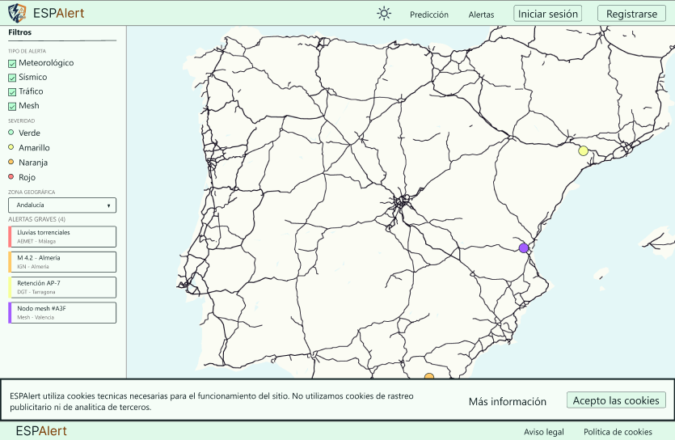
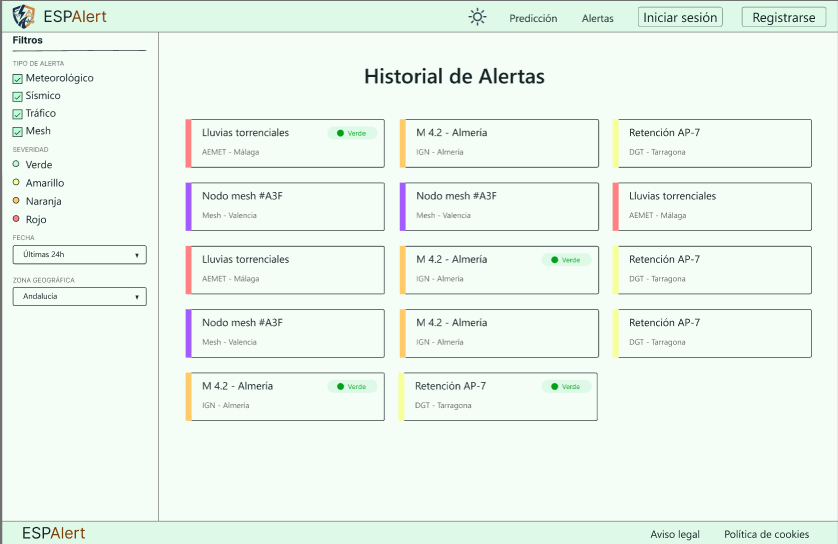
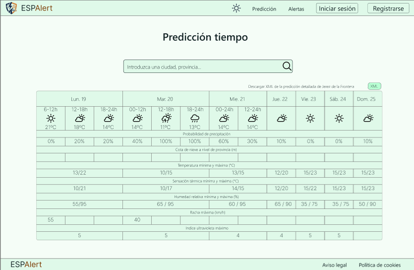
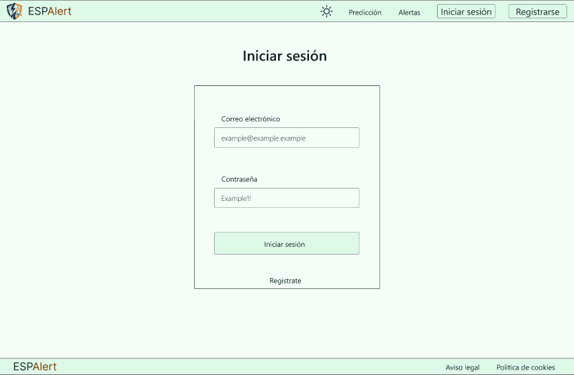
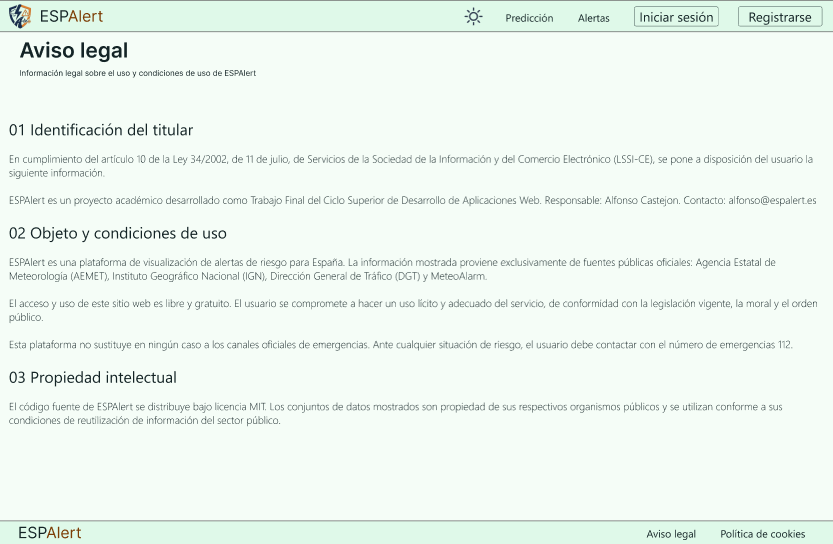
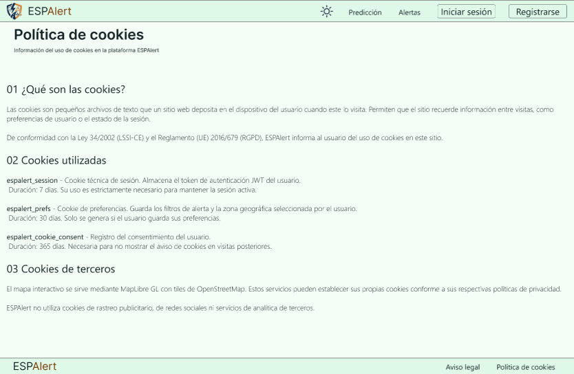

## Capturas de la implementación

Capturas reales de las pantallas principales una vez desplegadas:

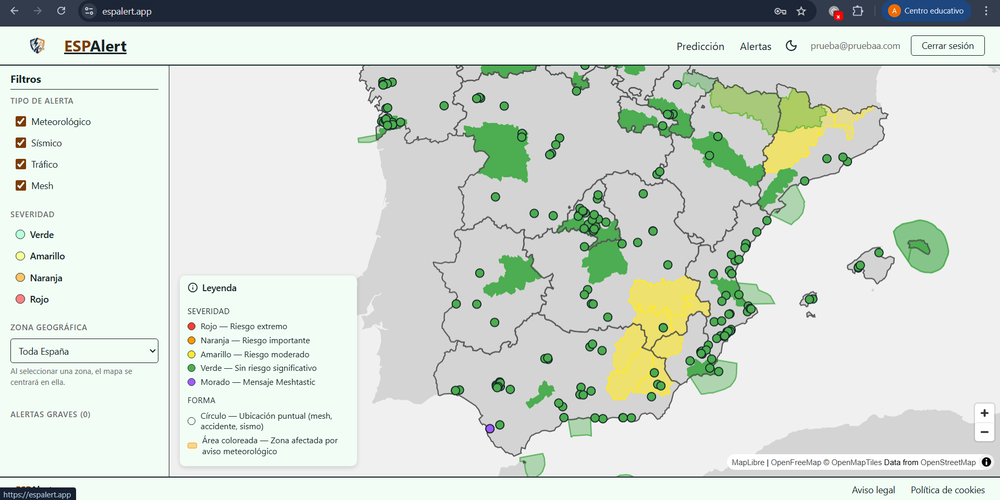
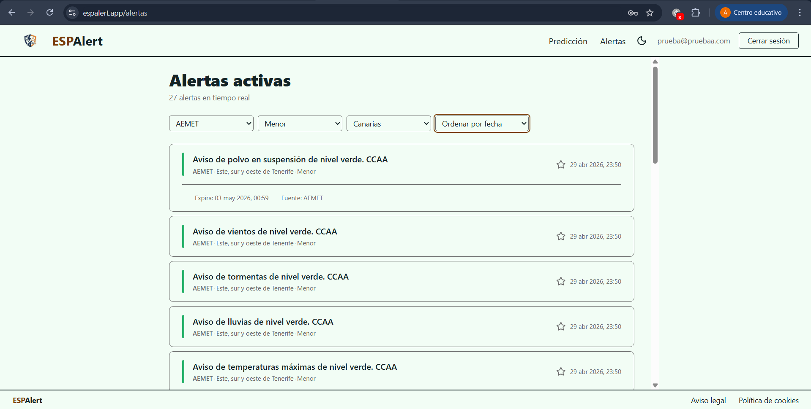
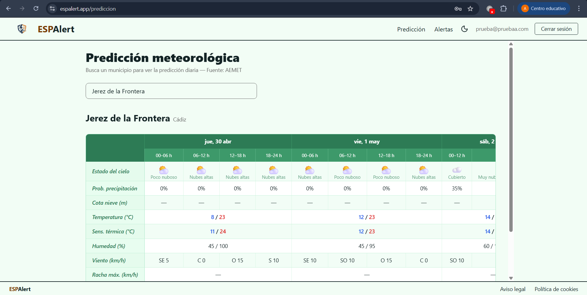
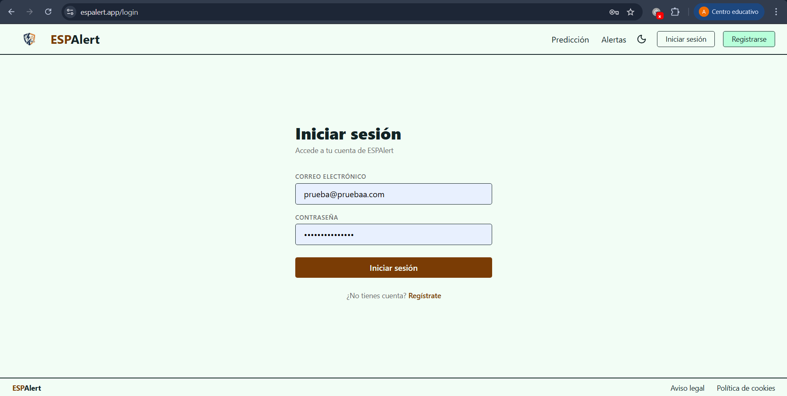
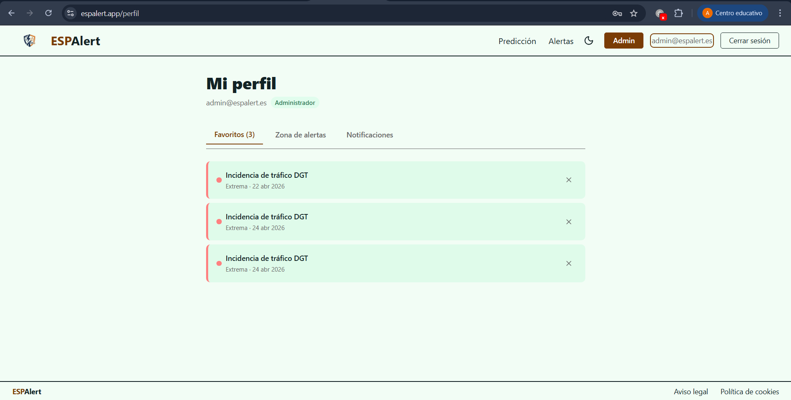
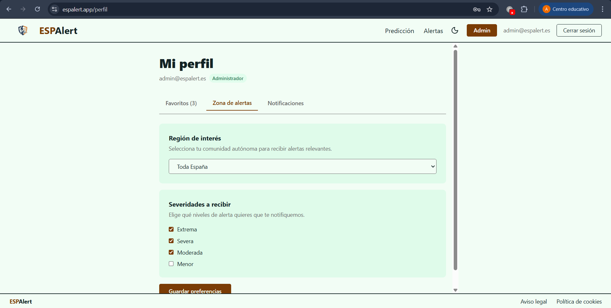
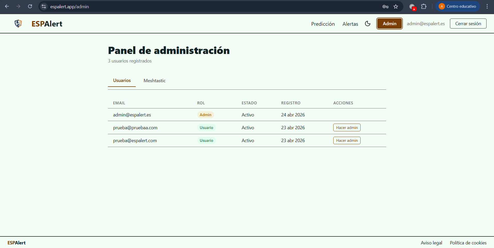
