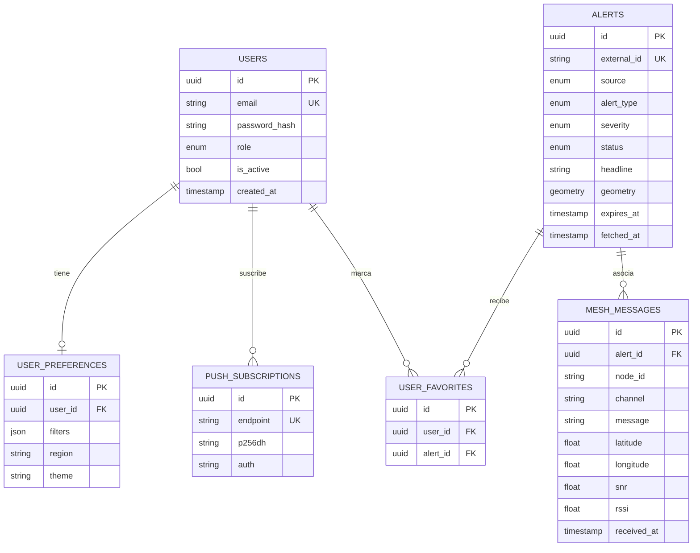
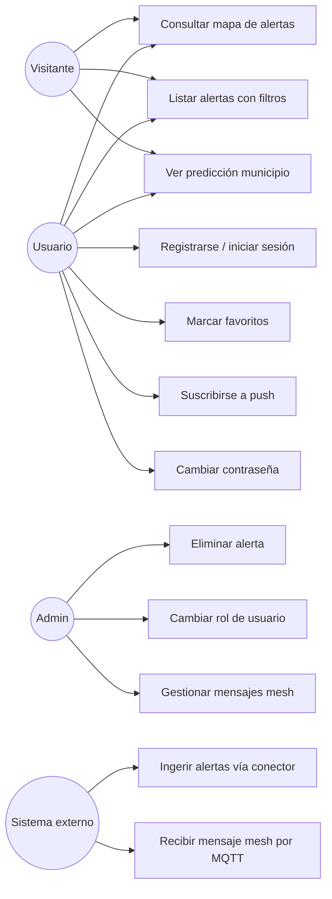
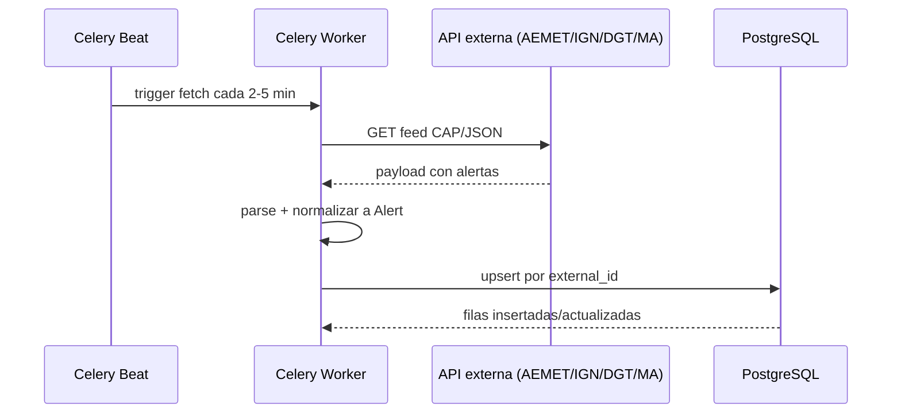
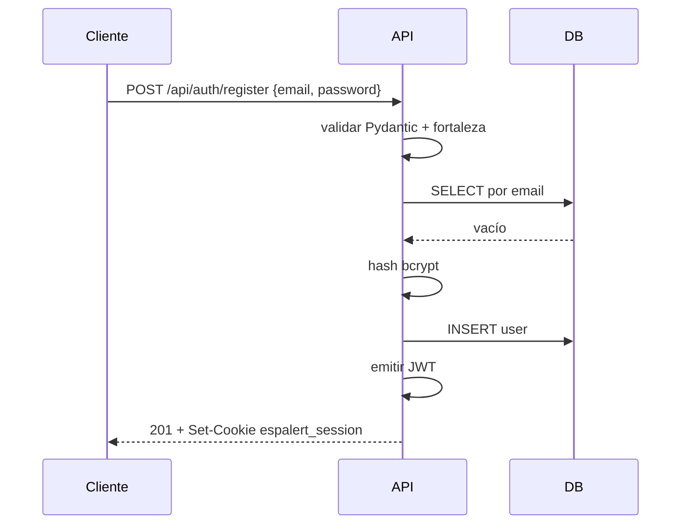
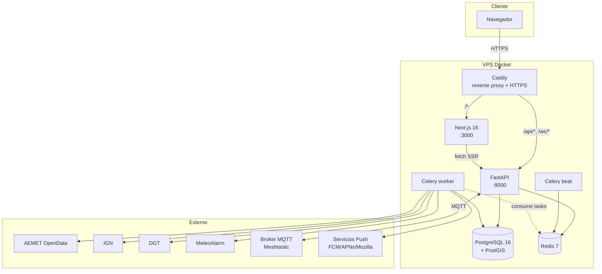

# 5. Diseño

## Modelo de datos

### Diagrama entidad-relación



Cardinalidades:

- `users` 1:1 `user_preferences` (un usuario tiene como mucho una fila de preferencias).
- `users` 1:N `push_subscriptions` (un usuario puede tener varios navegadores suscritos).
- `users` N:M `alerts` mediante `user_favorites` (un usuario favoritea varias alertas y una alerta puede tener muchos favoritos).
- `alerts` 1:N `mesh_messages` (un mensaje mesh puede asociarse opcionalmente a una alerta).

Los identificadores son UUID generados en base de datos (`gen_random_uuid()`). La columna `geometry` de `alerts` usa PostGIS con índice GIST para consultas espaciales (filtro por bounding box del mapa). Las foreign key con `ON DELETE CASCADE` garantizan que al borrar un usuario se borren sus preferencias, favoritos y suscripciones; los mensajes mesh usan `ON DELETE SET NULL` para no perder el histórico mesh aunque desaparezca su alerta vinculada.

## Consultas representativas

Más allá de los CRUD básicos, el modelo soporta consultas complejas que aprovechan PostGIS y los índices declarados:

### Filtro espacial por bounding box del mapa

```sql
SELECT a.*, ST_AsGeoJSON(a.geometry) AS geom
FROM alerts a
WHERE a.status = 'active'
  AND a.expires_at > NOW()
  AND ST_Intersects(
        a.geometry,
        ST_MakeEnvelope(:min_lon, :min_lat, :max_lon, :max_lat, 4326)
      )
ORDER BY a.severity DESC, a.created_at DESC
LIMIT 500;
```

Usa el índice GIST sobre `geometry` (`CREATE INDEX ix_alerts_geometry ON alerts USING GIST(geometry)`), lo que permite filtrar miles de filas en milisegundos en lugar de cargarlas todas en memoria.

### Listado con paginación y orden multi-criterio

```sql
SELECT a.*
FROM alerts a
WHERE (:source IS NULL OR a.source = :source)
  AND (:severity IS NULL OR a.severity = :severity)
  AND (:region IS NULL OR a.region = :region)
ORDER BY
  CASE WHEN :order_by = 'severity' THEN a.severity END DESC,
  a.created_at DESC
LIMIT :limit OFFSET :offset;
```

Filtros opcionales con SQL nullable y orden estable que combina severidad y fecha para que la paginación no salte filas entre páginas.

### Favoritos con join y agregación

```sql
SELECT a.*, COUNT(uf.id) AS fav_count
FROM alerts a
LEFT JOIN user_favorites uf ON uf.alert_id = a.id
WHERE a.id = ANY(:ids)
GROUP BY a.id;
```

Usado para mostrar en el listado cuántos usuarios han marcado cada alerta sin hacer N+1 queries.

### Purga programada de alertas antiguas

```sql
DELETE FROM alerts
WHERE expires_at < NOW() - INTERVAL '14 days'
RETURNING id;
```

Ejecutada por una tarea Celery Beat diaria. Los clientes refrescan su listado en el siguiente ciclo de polling.

## Casos de uso



## Diagramas de flujo

### Flujo de ingesta de alertas



### Flujo de registro y login



## Arquitectura de la aplicación



### Justificación de servicios

- **Caddy** como reverse proxy: gestiona automáticamente certificados Let's Encrypt y centraliza los headers de seguridad (HSTS, X-Content-Type-Options, X-Frame-Options, Referrer-Policy, Permissions-Policy).
- **Next.js** sirve el frontend con rendering híbrido (estático más componentes cliente para mapa y formularios).
- **FastAPI** expone la API REST y el WebSocket. Async para aprovechar I/O bound de las llamadas externas.
- **Celery worker + beat**: separa el polling de las APIs externas del request-response. Beat dispara las tareas periódicas, los workers las ejecutan.
- **PostgreSQL + PostGIS**: persistencia y consultas espaciales (bounding box del mapa).
- **Redis**: broker de Celery y backend de resultados.

## Diseño de la API

La API expone recursos REST bajo el prefijo `/api`. La documentación interactiva (Swagger UI en `/docs`, ReDoc en `/redoc` y esquema JSON en `/openapi.json`) está disponible directamente cuando se accede al contenedor de la API en desarrollo (puerto 8000). En producción no se enruta por Caddy para no exponer la superficie de la API públicamente.

### Autenticación

- `POST /api/auth/register` - crear cuenta. Limitado a 5 por hora por IP.
- `POST /api/auth/login` - iniciar sesión. Limitado a 10 por minuto por IP.
- `POST /api/auth/logout` - cerrar sesión.
- `GET /api/auth/me` - perfil del usuario autenticado.
- `PATCH /api/auth/password` - cambiar contraseña.

### Alertas (públicas)

- `GET /api/alerts` - listado activo con filtros (`source`, `severity`, `region`, `order_by`, `limit`, `offset`).
- `GET /api/alerts/history` - histórico expirado.
- `GET /api/alerts/{alert_id}` - detalle.

### Predicción

- `GET /api/forecast/municipios?q={texto}` - búsqueda de municipios.
- `GET /api/forecast/{codigo_ine}` - predicción diaria.

### Usuario autenticado

- `GET /api/user/favorites` - listar favoritos.
- `POST /api/user/favorites/{alert_id}` - añadir favorito.
- `DELETE /api/user/favorites/{alert_id}` - quitar favorito.
- `GET /api/user/preferences` - leer preferencias.
- `PUT /api/user/preferences` - guardar preferencias.

### Notificaciones push

- `POST /api/push/subscribe` - registrar suscripción VAPID.
- `DELETE /api/push/subscribe` - eliminar suscripción.

### Mesh

- `GET /api/mesh/messages` - listado público de mensajes mesh recientes.

### Administración

- `GET /api/admin/users` - listar usuarios.
- `PATCH /api/admin/users/{user_id}/role` - cambiar rol.
- `DELETE /api/admin/alerts/{alert_id}` - eliminar alerta.
- `GET /api/admin/mesh` - listar mensajes mesh.
- `DELETE /api/admin/mesh/{message_id}` - eliminar mensaje.
- `DELETE /api/admin/mesh` - purgar todos los mensajes.

### WebSocket

- `WS /ws` - canal autenticado por cookie de sesión. Si la cookie falta o el usuario está inactivo, el backend cierra con código 1008. Actualmente solo emite eventos `ping` periódicos como heartbeat para mantener vivas las conexiones; queda preparado para difundir eventos de alertas en futuras iteraciones.

### Códigos HTTP usados

- `200 OK` - lectura exitosa.
- `201 Created` - registro de usuario, alta de favorito.
- `204 No Content` - logout, cambio de contraseña, eliminación.
- `400 Bad Request` - JSON malformado.
- `401 Unauthorized` - falta cookie o credenciales inválidas.
- `403 Forbidden` - usuario autenticado pero sin rol suficiente.
- `404 Not Found` - recurso inexistente.
- `409 Conflict` - email ya registrado.
- `422 Unprocessable Content` - validación Pydantic falla.
- `429 Too Many Requests` - rate limit superado en login/registro.

Las respuestas de error siguen el formato estándar de FastAPI: `{"detail": "mensaje"}` o, en caso de validación, una lista de errores por campo.

### Documentación interactiva

FastAPI genera automáticamente la especificación OpenAPI 3.1 a partir de los schemas Pydantic y los tipos de los endpoints. Disponible en:

- **Swagger UI** en `/docs`: interfaz interactiva para probar cada endpoint, con autenticación integrada (la cookie de sesión se reutiliza).
- **ReDoc** en `/redoc`: visualización alternativa más enfocada a lectura.
- **Esquema JSON** en `/openapi.json`: importable a Postman, Insomnia o herramientas de generación de clientes.

### Peticiones de prueba (curl)

Ejemplos reales para verificar la API tras un despliegue:

```bash
# Health check
curl https://espalert.app/api/health
# {"api":"ok","sources":[{"source":"aemet","status":"running",...},...]}

# Registro
curl -X POST https://espalert.app/api/auth/register \
  -H "Content-Type: application/json" \
  -d '{"email":"test@example.com","password":"Demo1234"}' \
  -c cookies.txt
# 201 Created + Set-Cookie espalert_session=...

# Login
curl -X POST https://espalert.app/api/auth/login \
  -H "Content-Type: application/json" \
  -d '{"email":"test@example.com","password":"Demo1234"}' \
  -c cookies.txt

# Perfil autenticado
curl https://espalert.app/api/auth/me -b cookies.txt

# Listado de alertas con filtros y paginación
curl "https://espalert.app/api/alerts?source=AEMET&severity=severe&limit=10&offset=0"

# Buscar municipio
curl "https://espalert.app/api/forecast/municipios?q=madrid"

# Predicción por código INE
curl https://espalert.app/api/forecast/28079

# Marcar alerta como favorita (requiere sesión)
curl -X POST https://espalert.app/api/user/favorites/<alert-id> -b cookies.txt
# 201 Created

# Endpoint admin (requiere rol admin)
curl https://espalert.app/api/admin/users -b cookies-admin.txt
```

Para importar a Postman o Insomnia, levanta el entorno local con `docker compose up` y usa `http://localhost:8000/openapi.json` desde la opción "Import from URL" de cualquiera de las dos herramientas.
