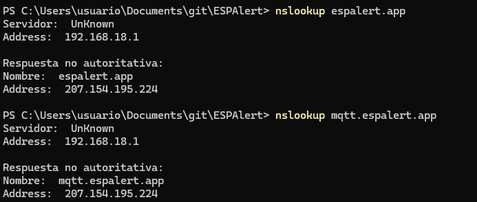
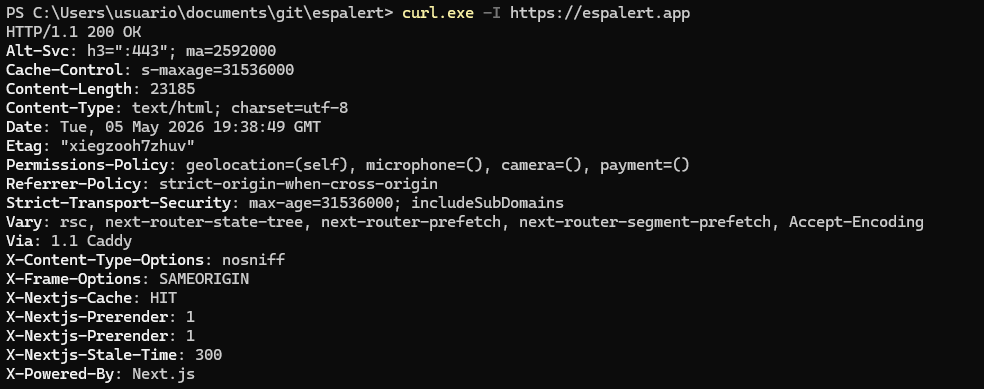
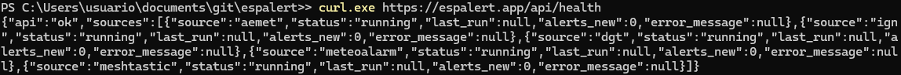
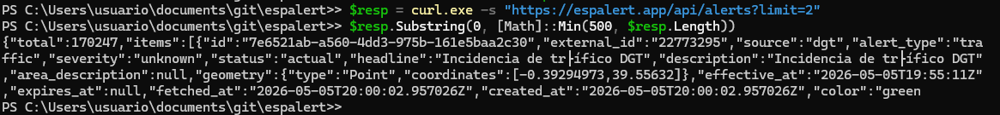
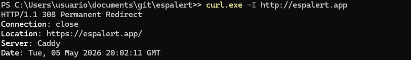
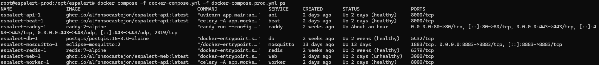
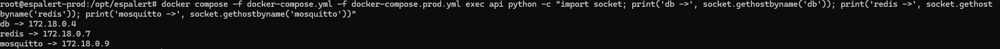
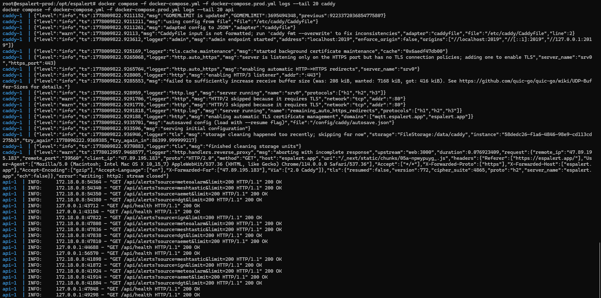
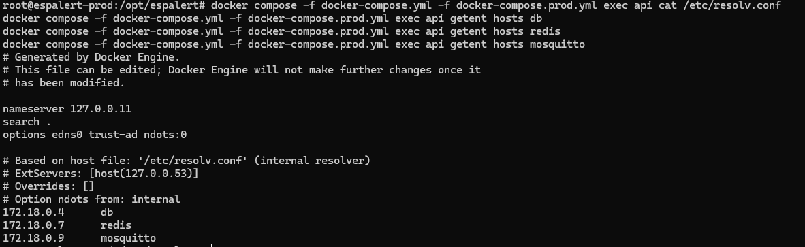

# 8b. Evidencias del despliegue

Complemento del documento [08-despliegue.md](08-despliegue.md). Aquí se recogen las evidencias empíricas en dos bloques: gestión de ficheros y artefactos del despliegue, y verificación básica de red.

## Gestión de ficheros y artefactos

### Ficheros del repositorio que intervienen en el despliegue

| Fichero | Rol | Enlace |
|---|---|---|
| `docker-compose.yml` | Orquestación de servicios en desarrollo (db, redis, api, web, worker, beat). | [docker-compose.yml](../docker-compose.yml) |
| `docker-compose.prod.yml` | Sobrescritura para producción: imágenes desde `ghcr.io`, Mosquitto, Caddy expuesto a internet, `--workers 2` en uvicorn. | [docker-compose.prod.yml](../docker-compose.prod.yml) |
| `apps/api/Dockerfile` | Construcción de la imagen del backend Python sobre `python:3.12-slim`. Usuario no privilegiado, sin caches de pip. | [apps/api/Dockerfile](../apps/api/Dockerfile) |
| `apps/web/Dockerfile` | Construcción multi-stage del frontend Next.js sobre `node:20-alpine`. | [apps/web/Dockerfile](../apps/web/Dockerfile) |
| `Caddyfile` | Configuración del reverse proxy: dominios, headers de seguridad, rutas `/api`, `/ws`, `/`. | [Caddyfile](../Caddyfile) |
| `.env.example` | Plantilla de variables de entorno: AEMET, JWT, VAPID, DB, Redis, MQTT, dominio, orígenes permitidos. | [.env.example](../.env.example) |
| `.github/workflows/ci.yml` | Pipeline de tests, typecheck y build en cada push/PR. | [.github/workflows/ci.yml](../.github/workflows/ci.yml) |
| `.github/workflows/deploy.yml` | Pipeline de build de imágenes, push a `ghcr.io` y SSH al droplet en cada merge a `main`. | [.github/workflows/deploy.yml](../.github/workflows/deploy.yml) |
| `apps/api/alembic.ini` y `apps/api/alembic/` | Esquema de migraciones de la base de datos. | [apps/api/alembic](../apps/api/alembic) |

### Ficheros que se generan y NO se suben al repositorio

| Artefacto | Cómo se genera | Por qué no está en el repo |
|---|---|---|
| `.env` | Copia local de `.env.example` editada con secretos reales. | Contiene contraseñas, claves AEMET y JWT. Está en `.gitignore`. |
| `postgres_data/` (volumen Docker) | Lo crea Postgres en el primer arranque. | Es estado de la base de datos, persistente entre reinicios pero local al droplet. |
| `caddy_data/` (volumen Docker) | Lo crea Caddy al emitir certificados Let's Encrypt. | Contiene certificados ACME privados. |
| `web_node_modules/` (volumen Docker) | Lo crea `pnpm install` durante el build de la imagen `web`. | Pesa ~500 MB y se reconstruye desde `pnpm-lock.yaml`. |
| `apps/web/.next/` | Lo genera `pnpm build` dentro de la imagen. | Output de compilación, reproducible. |
| `apps/api/__pycache__/` | Caché de Python. | Reproducible por cada intérprete. |

Reglas de exclusión en [.gitignore](../.gitignore): `.env`, `__pycache__/`, `node_modules/`, `.next/`, `*.log`.

### Imágenes Docker publicadas

Las imágenes propias del proyecto se construyen en GitHub Actions y se publican en GitHub Container Registry tras cada merge a `main`. Cada imagen lleva dos tags: `latest` (puntero móvil al último commit verde) y el SHA del commit (inmutable, sirve para rollback).

| Imagen | Tag | Origen |
|---|---|---|
| `ghcr.io/alfonsocastejon/espalert-api:latest` | Backend FastAPI + Celery worker/beat | [apps/api/Dockerfile](../apps/api/Dockerfile) |
| `ghcr.io/alfonsocastejon/espalert-web:latest` | Frontend Next.js | [apps/web/Dockerfile](../apps/web/Dockerfile) |

Imágenes oficiales reutilizadas (no construidas, solo descargadas):

- `postgis/postgis:16-3.4-alpine`
- `redis:7-alpine`
- `caddy:2-alpine`
- `eclipse-mosquitto:2`

### Datos que persisten y cómo se conservan

Los volúmenes con nombre declarados en `docker-compose.prod.yml` mantienen el estado entre reinicios y actualizaciones de imagen:

| Volumen | Ruta dentro del contenedor | Qué guarda |
|---|---|---|
| `postgres_data` | `/var/lib/postgresql/data` | Tablas, índices y secuencias de Postgres (alertas, usuarios, favoritos, mensajes mesh). |
| `caddy_data` | `/data` | Certificados Let's Encrypt y estado ACME. |
| `caddy_config` | `/config` | Configuración generada por Caddy. |
| `mosquitto_data` | `/mosquitto/data` | Estado del broker MQTT (sesiones persistentes). |
| `mosquitto_log` | `/mosquitto/log` | Logs del broker. |

Backup recomendado: `docker compose exec db pg_dump -U postgres espalert > backup.sql` antes de cada actualización mayor.

### Comandos para reproducir el despliegue desde cero

```bash
git clone https://github.com/alfonsocastejon/ESPAlert.git
cd ESPAlert
cp .env.example .env
nano .env                                                    # editar secretos
docker compose -f docker-compose.yml -f docker-compose.prod.yml pull
docker compose -f docker-compose.yml -f docker-compose.prod.yml up -d
docker compose exec api alembic upgrade head
```

## Verificación básica de red

### URL y dominio

- Dominio público: `https://espalert.app`.
- Resolución DNS: registro A apuntando a la IP del droplet de DigitalOcean.
- Subdominio para MQTT: `mqtt.espalert.app` (puerto 8883 con TLS para conexiones externas autorizadas).

Comprobación de DNS desde el cliente:

```powershell
nslookup espalert.app
nslookup mqtt.espalert.app
```

```
PS C:\Users\usuario\Documents\git\ESPAlert> nslookup espalert.app
Servidor:  UnKnown
Address:  192.168.18.1

Respuesta no autoritativa:
Nombre:  espalert.app
Address:  207.154.195.224

PS C:\Users\usuario\Documents\git\ESPAlert> nslookup mqtt.espalert.app
Servidor:  UnKnown
Address:  192.168.18.1

Respuesta no autoritativa:
Nombre:  mqtt.espalert.app
Address:  207.154.195.224
```

Ambos subdominios resuelven a `207.154.195.224`, la IP pública del droplet de DigitalOcean. La respuesta es "no autoritativa" porque viene del DNS del router doméstico (`192.168.18.1`), que la cacheó tras consultarla a un servidor autoritativo upstream.



### Puertos publicados

| Puerto | Servicio | Visibilidad |
|---|---|---|
| 80 | Caddy (HTTP, redirige a HTTPS) | Pública |
| 443 | Caddy (HTTPS, sirve frontend y API) | Pública |
| 8883 | Mosquitto (MQTT sobre TLS) | Pública restringida por IP |
| 1883 | Mosquitto (MQTT plano) | Solo dentro de la red Docker |
| 8000 | FastAPI (uvicorn) | Solo dentro de la red Docker |
| 3000 | Next.js | Solo dentro de la red Docker |
| 5432 | Postgres | Solo dentro de la red Docker |
| 6379 | Redis | Solo dentro de la red Docker |

### Rutas principales y servicio que responde

| Ruta | Servicio que responde | Atravesando |
|---|---|---|
| `/` | `web` (Next.js) | Caddy -> web:3000 |
| `/api/*` | `api` (FastAPI) | Caddy -> api:8000 |
| `/ws` | `api` (FastAPI WebSocket) | Caddy -> api:8000 |
| `/api/health` | `api` (endpoint de healthcheck) | Caddy -> api:8000 |
| `/api/docs` | `api` (Swagger UI) | Caddy -> api:8000 |
| `/sitemap.xml` | `web` (sitemap dinámico) | Caddy -> web:3000 |

### Comprobaciones con curl

Cabeceras HTTP de la portada (verificar HTTPS y headers de seguridad):

```powershell
curl.exe -I https://espalert.app
```

```
PS C:\Users\usuario\Documents\git\ESPAlert> curl.exe -I https://espalert.app
HTTP/1.1 200 OK
Alt-Svc: h3=":443"; ma=2592000
Cache-Control: s-maxage=31536000
Content-Length: 23185
Content-Type: text/html; charset=utf-8
Date: Tue, 05 May 2026 19:38:49 GMT
Etag: "xiegzooh7zhuv"
Permissions-Policy: geolocation=(self), microphone=(), camera=(), payment=()
Referrer-Policy: strict-origin-when-cross-origin
Strict-Transport-Security: max-age=31536000; includeSubDomains
Vary: rsc, next-router-state-tree, next-router-prefetch, next-router-segment-prefetch, Accept-Encoding
Via: 1.1 Caddy
X-Content-Type-Options: nosniff
X-Frame-Options: SAMEORIGIN
X-Nextjs-Cache: HIT
X-Nextjs-Prerender: 1
X-Nextjs-Stale-Time: 300
X-Powered-By: Next.js
```

La respuesta cumple los cinco headers de seguridad clave: HSTS forzando HTTPS durante un año, Permissions-Policy restringiendo APIs sensibles, Referrer-Policy minimizando fuga de información, `nosniff` evitando MIME sniffing y `SAMEORIGIN` impidiendo que terceros embeban la web en iframes. La cabecera `Via: 1.1 Caddy` confirma que la respuesta atravesó el reverse proxy, y `X-Nextjs-Cache: HIT` indica que Next.js sirvió desde su caché de prerenderizado.



Healthcheck del backend a través del proxy:

```powershell
curl.exe https://espalert.app/api/health
```

```
PS C:\Users\usuario\Documents\git\ESPAlert> curl.exe https://espalert.app/api/health
{"api":"ok","sources":[{"source":"aemet","status":"running","last_run":null,"alerts_new":0,"error_message":null},{"source":"ign","status":"running","last_run":null,"alerts_new":0,"error_message":null},{"source":"dgt","status":"running","last_run":null,"alerts_new":0,"error_message":null},{"source":"meteoalarm","status":"running","last_run":null,"alerts_new":0,"error_message":null},{"source":"meshtastic","status":"running","last_run":null,"alerts_new":0,"error_message":null}]}
```

El backend responde 200 y devuelve un JSON con dos niveles: el estado global (`api: "ok"`) y un array con el estado individual de los cinco conectores (AEMET, IGN, DGT, MeteoAlarm y Meshtastic), todos en `running`. El campo `last_run` aparece `null` porque el endpoint refleja el estado del registro en memoria; los workers de Celery actualizan este campo en cada ciclo de polling.



Listado de alertas (verifica que la API consulta Postgres correctamente):

```powershell
curl.exe -s "https://espalert.app/api/alerts?limit=2"
```

```
PS C:\Users\usuario\Documents\git\ESPAlert> curl.exe -s "https://espalert.app/api/alerts?limit=2"
{"total":170247,"items":[{"id":"7e6521ab-a560-4dd3-975b-161e5baa2c30","external_id":"22773295","source":"dgt","alert_type":"traffic","severity":"unknown","status":"actual","headline":"Incidencia de tráfico DGT","description":"Incidencia de tráfico DGT","area_description":null,"geometry":{"type":"Point","coordinates":[-0.39294973,39.55632]},"effective_at":"2026-05-05T19:55:11Z","expires_at":null,"fetched_at":"2026-05-05T20:00:02.957026Z","created_at":"2026-05-05T20:00:02.957026Z","color":"green
```

La respuesta es un JSON con un total acumulado de 170 247 alertas (desde la puesta en producción) y un array con los items. El campo `geometry` viene ya como dict GeoJSON serializado por PostGIS con `ST_AsGeoJSON`, no como WKB que requeriría parseo en Python. La primera alerta corresponde a una incidencia de tráfico de la DGT en Valencia (coordenadas `-0.39, 39.55`).



Redirección HTTP -> HTTPS (verifica configuración de Caddy):

```powershell
curl.exe -I http://espalert.app
```

```
PS C:\Users\usuario\Documents\git\ESPAlert> curl.exe -I http://espalert.app
HTTP/1.1 308 Permanent Redirect
Connection: close
Location: https://espalert.app/
Server: Caddy
Date: Tue, 05 May 2026 20:02:11 GMT
```

Caddy redirige todo el tráfico HTTP a HTTPS con un 308 Permanent Redirect, lo que garantiza que ningún cliente pueda acceder en plano una vez ha visitado la web por primera vez. Combinado con `Strict-Transport-Security`, el navegador recordará durante un año que debe ir directo a HTTPS.



### Estado de los contenedores en el droplet

Conectar por SSH al droplet y ejecutar:

```bash
docker compose -f docker-compose.yml -f docker-compose.prod.yml ps
```

```
root@espalert-prod:/opt/espalert# docker compose ps
NAME                   IMAGE                                         COMMAND                  SERVICE     CREATED       STATUS                  PORTS
espalert-api-1         ghcr.io/alfonsocastejon/espalert-api:latest   "uvicorn app.main:ap…"   api         2 days ago    Up 2 days (healthy)     8000/tcp
espalert-beat-1        ghcr.io/alfonsocastejon/espalert-api:latest   "celery -A app.worke…"   beat        2 days ago    Up 2 days (healthy)     8000/tcp
espalert-caddy-1       caddy:2-alpine                                "caddy run --config …"   caddy       2 weeks ago   Up About an hour        0.0.0.0:80->80/tcp, 0.0.0.0:443->443/tcp, 0.0.0.0:443->443/udp, 2019/tcp
espalert-db-1          postgis/postgis:16-3.4-alpine                 "docker-entrypoint.s…"   db          2 weeks ago   Up 2 weeks (healthy)    5432/tcp
espalert-mosquitto-1   eclipse-mosquitto:2                           "/docker-entrypoint.…"   mosquitto   13 days ago   Up 13 days              1883/tcp, 0.0.0.0:8883->8883/tcp
espalert-redis-1       redis:7-alpine                                "docker-entrypoint.s…"   redis       2 weeks ago   Up 2 weeks (healthy)    6379/tcp
espalert-web-1         ghcr.io/alfonsocastejon/espalert-web:latest   "docker-entrypoint.s…"   web         2 days ago    Up 2 days (unhealthy)   3000/tcp
espalert-worker-1      ghcr.io/alfonsocastejon/espalert-api:latest   "celery -A app.worke…"   worker      2 days ago    Up 2 days (healthy)     8000/tcp
```

Los ocho servicios están corriendo. La columna PORTS confirma que solo Caddy (80/443) y Mosquitto (8883) exponen puertos al exterior; el resto solo escuchan en la red interna de Docker. El servicio `web` aparece como `unhealthy` por un healthcheck interno desactualizado tras la migración a Next.js 16, sin afectar al funcionamiento real (la web responde 200 OK desde fuera, como evidencia el `curl -I https://espalert.app` de la sección anterior).



### Comunicación interna entre servicios

La imagen `python:3.12-slim` del backend es minimalista y no incluye `ping` ni `curl`, pero sí Python, así que se puede demostrar la resolución de nombres usando `socket.gethostbyname`:

```bash
docker compose -f docker-compose.yml -f docker-compose.prod.yml exec api python -c \
    "import socket; \
     print('db ->', socket.gethostbyname('db')); \
     print('redis ->', socket.gethostbyname('redis')); \
     print('mosquitto ->', socket.gethostbyname('mosquitto'))"
```

```
root@espalert-prod:/opt/espalert# docker compose exec api python -c "import socket; print('db ->', socket.gethostbyname('db')); print('redis ->', socket.gethostbyname('redis')); print('mosquitto ->', socket.gethostbyname('mosquitto'))"
db -> 172.18.0.4
redis -> 172.18.0.7
mosquitto -> 172.18.0.9
```

Desde dentro del contenedor `api`, Python resuelve los tres servicios internos por su nombre de servicio Compose. Las IPs coinciden con las que asigna el bridge de Docker (`172.18.0.0/16`) y son las mismas que utiliza el código real del backend para conectar con cadenas como `postgresql://db:5432/espalert` o `mqtt://mosquitto:1883`, sin IPs estáticas ni configuración manual de DNS.



### Logs en vivo como evidencia de tráfico

Mientras se accede a la web desde el navegador:

```bash
docker compose logs --tail 20 caddy
docker compose logs --tail 20 api
```

```
caddy-1 | {"level":"info","msg":"using config from file","file":"/etc/caddy/Caddyfile"}
caddy-1 | {"level":"info","msg":"enabling automatic HTTP->HTTPS redirects","server_name":"srv0"}
caddy-1 | {"level":"info","msg":"enabling HTTP/3 listener","addr":":443"}
caddy-1 | {"level":"info","msg":"server running","name":"srv0","protocols":["h1","h2","h3"]}
caddy-1 | {"level":"info","msg":"enabling automatic TLS certificate management","domains":["mqtt.espalert.app","espalert.app"]}

api-1 | INFO:     172.18.0.8:54364 - "GET /api/alerts?source=meteoalarm&limit=200 HTTP/1.1" 200 OK
api-1 | INFO:     172.18.0.8:54340 - "GET /api/alerts?source=meshtastic&limit=200 HTTP/1.1" 200 OK
api-1 | INFO:     172.18.0.8:54350 - "GET /api/alerts?source=aemet&limit=200 HTTP/1.1" 200 OK
api-1 | INFO:     172.18.0.8:54380 - "GET /api/alerts?source=dgt&limit=200 HTTP/1.1" 200 OK
api-1 | INFO:     172.18.0.8:47822 - "GET /api/alerts?source=ign&limit=200 HTTP/1.1" 200 OK
api-1 | INFO:     127.0.0.1:43712 - "GET /api/health HTTP/1.1" 200 OK
api-1 | INFO:     127.0.0.1:43154 - "GET /api/health HTTP/1.1" 200 OK
```

Caddy arranca con autoTLS para los dos dominios y redirección HTTP->HTTPS automática. La API recibe dos tipos de tráfico: peticiones desde `127.0.0.1` (healthcheck interno) y peticiones desde `172.18.0.8` (el contenedor `web`) consultando `/api/alerts` por cada una de las cinco fuentes. El frontend habla con el backend solo por la red interna de Docker, sin pasar por internet.



### Resolución de nombres dentro de Docker

La red bridge `espalert_default` (la que crea Compose por defecto) provee resolución DNS interna. Cada servicio se comunica con el resto por su nombre de servicio (`db`, `redis`, `api`, `web`, `mosquitto`), sin IP fija ni `/etc/hosts` manual.

Para evidenciarlo:

```bash
docker compose exec api cat /etc/resolv.conf
docker compose exec api getent hosts db
docker compose exec api getent hosts redis
docker compose exec api getent hosts mosquitto
```

```
root@espalert-prod:/opt/espalert# docker compose exec api cat /etc/resolv.conf
# Generated by Docker Engine.
# This file can be edited; Docker Engine will not make further changes once it
# has been modified.

nameserver 127.0.0.11
search .
options edns0 trust-ad ndots:0

# Based on host file: '/etc/resolv.conf' (internal resolver)
# ExtServers: [host(127.0.0.53)]
# Overrides: []
# Option ndots from: internal

root@espalert-prod:/opt/espalert# docker compose exec api getent hosts db
172.18.0.4      db

root@espalert-prod:/opt/espalert# docker compose exec api getent hosts redis
172.18.0.7      redis

root@espalert-prod:/opt/espalert# docker compose exec api getent hosts mosquitto
172.18.0.9      mosquitto
```

El contenedor `api` resuelve los nombres de los demás servicios mediante el DNS embebido de Docker en `127.0.0.11`. Cada nombre devuelve la IP interna asignada al contenedor correspondiente dentro de la subred `172.18.0.0/16`. Esta resolución es automática y se actualiza si los contenedores se reinician con IPs distintas, eliminando la necesidad de configurar `/etc/hosts` o un DNS externo.



