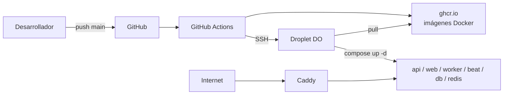

# 8. Despliegue

## Entorno de producción

ESPAlert se despliega en un VPS de DigitalOcean (droplet básico, 2 vCPU y 4 GB de RAM). Sobre el droplet se ejecuta Docker con `docker compose`, y Caddy actúa como reverse proxy gestionando HTTPS automático mediante Let's Encrypt. El dominio público es `espalert.app`.



## Dockerfiles

El proyecto contiene dos Dockerfiles propios y reutiliza imágenes oficiales para el resto.

### `apps/api/Dockerfile`

```dockerfile
FROM python:3.12-slim
WORKDIR /app
RUN apt-get update && apt-get install -y --no-install-recommends \
      libpq-dev gcc \
    && rm -rf /var/lib/apt/lists/*
RUN useradd --system --no-create-home appuser
COPY --chown=appuser requirements.txt .
RUN pip install --no-cache-dir -r requirements.txt
COPY --chown=appuser . .
USER appuser
EXPOSE 8000
CMD ["uvicorn", "app.main:app", "--host", "0.0.0.0", "--port", "8000"]
```

Decisiones:

- Imagen `python:3.12-slim`: ~120 MB en lugar de ~900 MB de la imagen completa.
- `libpq-dev` y `gcc` solo durante la instalación; se podrían eliminar en una build multi-stage para producción aún más reducida.
- Usuario no privilegiado `appuser`: el contenedor no corre como root, mitiga escalada de privilegios si hay un RCE.
- `--no-cache-dir` en pip evita guardar caches y reduce ~30 MB.

### `apps/web/Dockerfile`

Para producción, build multi-stage con `node:20-alpine`: la primera fase ejecuta `npm ci && npm run build`, la segunda fase copia solo el output de Next (modo `standalone`) y el usuario no privilegiado `nextjs:1001`. En desarrollo el `docker-compose.yml` monta el código como volumen y ejecuta `pnpm dev`.

### Imágenes oficiales

- `postgis/postgis:16-3.4-alpine`: Postgres 16 con PostGIS 3.4 ya incluido.
- `redis:7-alpine`: Redis 7 minimalista.
- `caddy:2-alpine`: Caddy 2 con autoTLS.
- `eclipse-mosquitto:2`: broker MQTT propio para el canal Meshtastic, sin exposición pública.

### Nodo Meshtastic gateway

El sistema utiliza un **nodo Meshtastic físico** compatible con el firmware oficial de Meshtastic, que actúa como gateway entre la radio LoRa y el broker MQTT interno. El nodo se configura una sola vez con `meshtastic --set mqtt.address <host>:1883`, `mqtt.username`, `mqtt.password` y se suscribe al topic `msh/espalert/json`.

A partir de ahí, el nodo se comunica con el broker exclusivamente por MQTT sobre TCP/IP a través de internet (puerto MQTT del droplet expuesto solo al rango de IPs autorizadas). La forma de dar conectividad al nodo (WiFi de una red doméstica, módem 4G, alimentación por placa solar con cualquiera de las anteriores) es independiente de la arquitectura: ESPAlert solo necesita que el nodo esté **autenticado contra Mosquitto** y mantenga la conexión MQTT viva.

### Publicación en registry

Las imágenes se publican en GitHub Container Registry tras cada merge a `main`:

- `ghcr.io/alfonsocastejon/espalert-api:latest` y por SHA del commit.
- `ghcr.io/alfonsocastejon/espalert-web:latest` y por SHA del commit.

Los tags por SHA permiten rollback inmediato a cualquier versión anterior.

## Servidor de aplicaciones

FastAPI por sí mismo es un framework ASGI; necesita un servidor de aplicaciones que lo ejecute. ESPAlert usa **Uvicorn** como servidor ASGI:

```
uvicorn app.main:app --host 0.0.0.0 --port 8000 --workers 2
```

En desarrollo se levanta con `--reload` para recargar al guardar; en producción con `--workers 2` (un proceso por núcleo del droplet básico). Cada worker maneja conexiones async sobre `uvloop`, lo que es ideal para el patrón I/O bound de las llamadas a AEMET, IGN, DGT y MeteoAlarm.

Logs estructurados:

- Acceso (`uvicorn.access`): cada petición HTTP con método, ruta, código y tiempo.
- Aplicación (`uvicorn.error` y loggers de la app): errores con traceback, eventos de Celery, conexiones MQTT.

Los logs se redirigen a stdout y los recoge Docker, accesibles con `docker compose logs -f api`.

### Pruebas de funcionamiento y carga ligera

```bash
# Verificación funcional
curl -i https://espalert.app/api/health

# Carga base con autocannon (1 conexión, 20 s)
npx autocannon -c 1 -d 20 https://espalert.app/api/alerts

# Carga realista (5 conexiones, 30 s)
npx autocannon -c 5 -d 30 https://espalert.app/api/alerts
```

Resultados medidos en el droplet básico (2 vCPU, 4 GB) con la geometría serializada por PostGIS (`ST_AsGeoJSON`) en lugar de en Python:

- **1 conexión**: mediana 552 ms, p99 920 ms, ~1.7 req/s. Es la latencia base de un único cliente sin contención; el suelo viene de la red TLS/TCP, la query a Postgres y la respuesta JSON de ~24 KB.
- **5 conexiones simultáneas**: mediana 1.2 s, p99 2.4 s, ~3.7 req/s sostenidas. Es el escenario realista de varios clientes haciendo polling desde el navegador.

Iteración previa, antes de mover la serialización a SQL: con la misma carga (5 conexiones) la mediana era 1.7 s y el throughput 2.8 req/s; mover el `ST_AsGeoJSON` a Postgres redujo un 29% la mediana de latencia y subió un 32% el throughput. Bajo una sola conexión la mejora es marginal porque el cuello de botella ya no es la serialización, sino la combinación de red, query SQL y volumen de respuesta.

Líneas de mejora identificadas para una segunda iteración: cachear la respuesta de `/api/alerts` en Redis con TTL corto (60 s), aumentar el `pool_size` de SQLAlchemy, y subir el droplet a 4 vCPU dedicadas si el tráfico crece más allá del uso académico previsto.

## Volúmenes, red y healthchecks

El `docker-compose.yml` declara:

- **Red interna**: Docker crea automáticamente una red bridge `espalert_default`. Los servicios se comunican por nombre (`db`, `redis`, `api`, `web`) sin exponer puertos al host. Solo `caddy` (80/443) y, en desarrollo, `api` (8000) y `web` (3000) publican puertos.
- **Volúmenes con nombre**:
  - `postgres_data` -> `/var/lib/postgresql/data`. Persiste la base de datos entre reinicios.
  - `web_node_modules` -> `/app/node_modules`. Aisla `node_modules` del bind mount del código.
  - `caddy_data` -> certificados Let's Encrypt y estado ACME.
- **Healthchecks**:
  - `db`: `pg_isready` cada 10 s.
  - `redis`: `redis-cli ping` cada 10 s.
  - `api`: `urllib.request.urlopen("/api/health")` cada 30 s con `start_period: 15s`.
- **`depends_on` con condition `service_healthy`** garantiza que la API no arranca hasta que la BD acepta conexiones, eliminando los típicos errores de "connection refused" en el primer arranque.

## Pipeline CI/CD

Dos workflows en `.github/workflows/`:

### `ci.yml`

Se dispara en cada push a `main` y en pull requests contra `main`. Tiene tres jobs paralelos:

1. **`web-typecheck`** sobre `apps/web`: setup de Node 20, `npm ci`, `npx tsc --noEmit` para verificar tipos y `npm test` (Vitest).
2. **`api-tests`** sobre `apps/api`: setup de Python 3.12 con cache de pip, `pip install -r requirements.txt` y `pytest`.
3. **`docker-build`** (depende de los dos anteriores): construye las imágenes Docker del API y el web con `docker buildx` sin publicarlas, como verificación de que la build de producción también funciona.

### `deploy.yml`

Se dispara solo en push a `main`. Tiene dos jobs en cadena:

1. **`build-and-push`**:
   - Login en `ghcr.io` usando el `GITHUB_TOKEN` automático del workflow.
   - Build de las imágenes `api` y `web` con `docker buildx`, etiquetas `latest` y SHA del commit.
   - Push a `ghcr.io/alfonsocastejon/espalert-api` y `ghcr.io/alfonsocastejon/espalert-web`.
2. **`deploy`** (depende del anterior): SSH al droplet con `appleboy/ssh-action`, hace `git pull`, `docker compose -f docker-compose.prod.yml pull`, `docker compose -f docker-compose.prod.yml up -d` y `docker system prune -f` para limpiar imágenes viejas.

Las migraciones de la base de datos **no se ejecutan automáticamente** en el deploy. Si una versión nueva incluye una migración Alembic, hay que aplicarla a mano por SSH con `docker compose exec api alembic upgrade head`. Es una limitación conocida del workflow actual.

### Secretos necesarios en GitHub

- `DO_HOST`: IP o dominio del droplet de DigitalOcean.
- `DO_SSH_KEY`: clave privada SSH con acceso al droplet.
- El token del registry (`GITHUB_TOKEN`) lo provee GitHub Actions automáticamente, no hay que configurarlo.

## Despliegue desde cero

### 1. Provisión del droplet

Crear el droplet en DigitalOcean (Ubuntu 22.04 LTS), añadir clave SSH y abrir puertos 22, 80 y 443 en el firewall. Crear un usuario `deploy` con `sudo` y deshabilitar login de root.

### 2. Instalación de Docker

```bash
curl -fsSL https://get.docker.com | sh
sudo usermod -aG docker deploy
```

### 3. Clonar el repositorio

```bash
git clone https://github.com/alfonsocastejon/ESPAlert.git
cd ESPAlert
```

### 4. Configurar variables de producción

```bash
cp .env.example .env
nano .env
```

Diferencias respecto al `.env` local:

- `ENV=production`
- `JWT_SECRET`: generar de nuevo con `python -c "import secrets; print(secrets.token_urlsafe(64))"`.
- `POSTGRES_PASSWORD`: nueva contraseña fuerte.
- `CADDY_DOMAIN=espalert.app`.
- `ALLOWED_ORIGINS=https://espalert.app`.
- `NEXT_PUBLIC_API_URL=https://espalert.app` y `NEXT_PUBLIC_WS_URL=wss://espalert.app`.

### 5. DNS

Crear un registro A de `espalert.app` apuntando a la IP del droplet. Caddy detectará el dominio y emitirá el certificado en el primer arranque.

### 6. Levantar los servicios

```bash
docker compose -f docker-compose.yml -f docker-compose.prod.yml up -d
docker compose exec api alembic upgrade head
```

### 7. Verificación

```bash
curl -I https://espalert.app
# Debe incluir Strict-Transport-Security: max-age=...
curl https://espalert.app/api/health
# {"api":"ok","sources":[{"source":"aemet",...},{"source":"ign",...},...]}
```

Comprobar visualmente: el mapa carga, el listado pagina, el registro funciona.

## Caddyfile

El `Caddyfile` se versiona en el repositorio y centraliza los headers de seguridad:

```caddy
{$CADDY_DOMAIN} {
    header {
        Strict-Transport-Security "max-age=31536000; includeSubDomains"
        X-Content-Type-Options "nosniff"
        X-Frame-Options "SAMEORIGIN"
        Referrer-Policy "strict-origin-when-cross-origin"
        Permissions-Policy "geolocation=(self), microphone=(), camera=(), payment=()"
        -Server
    }

    reverse_proxy /api/* api:8000
    reverse_proxy /ws/*  api:8000
    reverse_proxy /*     web:3000
}

mqtt.espalert.app {
    respond "MQTT broker en puerto 8883" 200
}
```

## Troubleshooting

- Logs en vivo: `docker compose logs -f api` (o `web`, `worker`, `caddy`).
- Reinicio aislado: `docker compose restart api`.
- Migración pendiente tras un deploy: `docker compose exec api alembic upgrade head`.
- Caddy no emite certificado: revisar que el DNS está propagado (`dig espalert.app`) y que los puertos 80/443 están abiertos. Borrar el volumen de Caddy fuerza un nuevo intento (`docker compose down && docker volume rm espalert_caddy_data && docker compose up -d`).
- Worker no procesa tareas: comprobar conexión a Redis con `docker compose exec api redis-cli -h redis ping`.

## Rollback

Si un despliegue rompe producción:

```bash
docker compose pull api:<sha-anterior>
docker compose up -d api
```

Cada imagen lleva tag con el SHA del commit, por lo que se puede revertir a cualquier versión publicada en `ghcr.io` sin tocar el código.
